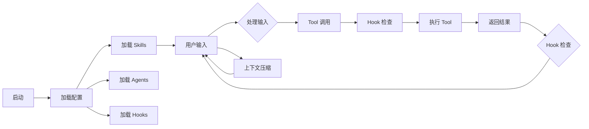

# 核心概念

> 理解 Claude Code 的核心架构和概念

## 架构概览

```
┌─────────────────────────────────────────────────────────────┐
│                      Claude Code                             │
├─────────────────────────────────────────────────────────────┤
│  ┌─────────────┐  ┌─────────────┐  ┌─────────────┐      │
│  │   Tools     │  │   Skills    │  │   Hooks     │      │
│  │  (60+ 个)   │  │   (用户定义) │  │   (27 种)   │      │
│  └─────────────┘  └─────────────┘  └─────────────┘      │
├─────────────────────────────────────────────────────────────┤
│  ┌─────────────┐  ┌─────────────┐  ┌─────────────┐      │
│  │  Agents     │  │  Plugins    │  │    MCP      │      │
│  │  (2+ 类型)   │  │  (扩展)    │  │  (集成)    │      │
│  └─────────────┘  └─────────────┘  └─────────────┘      │
├─────────────────────────────────────────────────────────────┤
│                        API Layer                             │
│                    (Anthropic Claude)                        │
└─────────────────────────────────────────────────────────────┘
```

---

## 核心组件

### 1. Tools（工具）

Claude Code 执行操作的能力来源。

| 工具类别 | 数量 | 示例 |
|----------|------|------|
| 文件操作 | 5 | Read, Write, Edit, Glob, Grep |
| 命令执行 | 1 | Bash |
| 网络 | 2 | WebFetch, WebSearch |
| 通信 | 3 | AgentTool, SkillTool, SendMessage |
| 其他 | 30+ | Task, Cron, Sleep 等 |

### 2. Skills（技能）

用户定义的可复用工作流。

```yaml
---
name: my-skill
description: 技能描述
---

技能内容...
```

### 3. Hooks（钩子）

在关键时机执行的脚本。共有 27 种 Hook 事件类型（详见 Hook 类型详解章节）。

### 4. Agents（代理）

具有特定角色的子进程。

- **Built-in**: Explore, Plan（均为 feature-gated）
- **Custom**: 用户定义的 Agent
- **Plugin**: 插件提供的 Agent

### 5. Plugins（插件）

扩展 Claude Code 功能的包。

```
Plugin = Skills + Agents + Hooks
```

### 6. MCP（Model Context Protocol）

与外部服务集成的协议。

```
Claude Code ←→ MCP Server ←→ External Service
```

---

## 会话生命周期



---

## 权限模型

### PermissionMode

| 模式 | 说明 |
|------|------|
| `default` | 每次询问用户 |
| `acceptEdits` | 自动接受编辑 |
| `bypassPermissions` | 绕过所有检查 |
| `dontAsk` | 不询问，直接拒绝 |
| `plan` | 仅在计划模式 |
| `auto` | 基于分类器 |

### 权限规则语法

```
Tool(operation)
Bash(git *)           # git 开头的命令
Read(*.md)            # md 文件
Edit(!*.json)         # 非 JSON 文件
```

---

## 上下文管理

### 上下文窗口

- **Opus**: 200K tokens
- **Sonnet**: 200K tokens
- **Haiku**: 200K tokens

### 上下文压缩

当上下文接近限制时，Claude Code 会自动压缩历史。

| 触发方式 | 说明 |
|----------|------|
| 自动 | 接近限制时触发 |
| 手动 | `/compact` 命令 |

---

## 配置层次

```
Policy Settings (最高)
    ↓
Flag Settings
    ↓
Local Settings (.gitignored)
    ↓
Project Settings (提交到 git)
    ↓
User Settings (最低)
```

---

## 记忆系统

### Auto-Memory

自动记录会话中的关键信息。

```json
{
  "autoMemoryEnabled": true,
  "autoMemoryDirectory": "~/.claude/projects/..."
}
```

### Session Memory

当前会话的记忆。

### Persistent Memory

跨会话的持久记忆。

---

## 关键概念

### 1. Tool Use Loop

Claude 与工具的交互循环：

```
用户输入 → Claude → 工具调用 → 结果 → Claude → ...
```

### 2. Subagent

在独立上下文中运行的 Agent。

```yaml
context: fork  # 子 Agent 执行
```

### 3. Session

一次完整的对话会话。

```bash
claude -c           # 继续上次会话
claude -r <id>     # 恢复指定会话
```

### 4. Worktree

Git worktree 隔离环境。

```bash
claude -w feature-x  # 在 worktree 中工作
```
