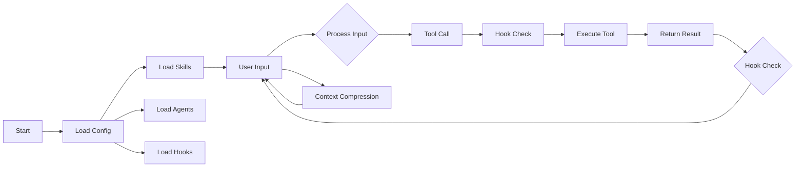

# Core Concepts

> Understanding the core architecture and concepts of Claude Code

## Architecture Overview

```
┌─────────────────────────────────────────────────────────────┐
│                      Claude Code                             │
├─────────────────────────────────────────────────────────────┤
│  ┌─────────────┐  ┌─────────────┐  ┌─────────────┐          │
│  │   Tools     │  │   Skills    │  │   Hooks     │          │
│  │  (60+)      │  │ (user-defined)│ (27 types)  │          │
│  └─────────────┘  └─────────────┘  └─────────────┘          │
├─────────────────────────────────────────────────────────────┤
│  ┌─────────────┐  ┌─────────────┐  ┌─────────────┐           │
│  │  Agents     │  │  Plugins    │  │    MCP      │           │
│  │  (2+ types) │  │ (extension) │  │ (integration)│          │
│  └─────────────┘  └─────────────┘  └─────────────┘          │
├─────────────────────────────────────────────────────────────┤
│                        API Layer                             │
│                    (Anthropic Claude)                        │
└─────────────────────────────────────────────────────────────┘
```

---

## Core Components

### 1. Tools

The capabilities that Claude Code uses to perform actions.

| Tool Category | Count | Examples |
|---------------|-------|----------|
| File Operations | 5 | Read, Write, Edit, Glob, Grep |
| Command Execution | 1 | Bash |
| Network | 2 | WebFetch, WebSearch |
| Communication | 3 | AgentTool, SkillTool, SendMessage |
| Other | 30+ | Task, Cron, Sleep, etc. |

### 2. Skills

User-defined reusable workflows.

```yaml
---
name: my-skill
description: Skill description
---

Skill content...
```

### 3. Hooks

Scripts that execute at key moments. There are 27 types of hook events (see Hook Types chapter for details).

### 4. Agents

Subprocesses with specific roles.

- **Built-in**: Explore, Plan (both feature-gated)
- **Custom**: User-defined agents
- **Plugin**: Agents provided by plugins

### 5. Plugins

Packages that extend Claude Code functionality.

```
Plugin = Skills + Agents + Hooks
```

### 6. MCP (Model Context Protocol)

A protocol for integrating with external services.

```
Claude Code ←→ MCP Server ←→ External Service
```

---

## Session Lifecycle



---

## Permission Model

### PermissionMode

| Mode | Description |
|------|-------------|
| `default` | Ask user each time |
| `acceptEdits` | Automatically accept edits |
| `bypassPermissions` | Bypass all checks |
| `dontAsk` | Do not ask, deny directly |
| `plan` | Only in plan mode |
| `auto` | Based on classifier |

### Permission Rule Syntax

```
Tool(operation)
Bash(git *)           # Commands starting with git
Read(*.md)            # Markdown files
Edit(!*.json)         # Non-JSON files
```

---

## Context Management

### Context Window

- **Opus**: 200K tokens
- **Sonnet**: 200K tokens
- **Haiku**: 200K tokens

### Context Compression

When context approaches the limit, Claude Code automatically compresses history.

| Trigger | Description |
|---------|-------------|
| Automatic | Triggers when approaching limit |
| Manual | `/compact` command |

---

## Configuration Hierarchy

```
Policy Settings (highest)
    ↓
Flag Settings
    ↓
Local Settings (.gitignored)
    ↓
Project Settings (committed to git)
    ↓
User Settings (lowest)
```

---

## Memory System

### Auto-Memory

Automatically records key information from sessions.

```json
{
  "autoMemoryEnabled": true,
  "autoMemoryDirectory": "~/.claude/projects/..."
}
```

### Session Memory

Memory for the current session.

### Persistent Memory

Persistent memory across sessions.

---

## Key Concepts

### 1. Tool Use Loop

Claude's interaction loop with tools:

```
User Input → Claude → Tool Call → Result → Claude → ...
```

### 2. Subagent

An agent running in an isolated context.

```yaml
context: fork  # Subagent execution
```

### 3. Session

A complete conversation session.

```bash
claude -c           # Continue previous session
claude -r <id>      # Resume specified session
```

### 4. Worktree

Git worktree isolation environment.

```bash
claude -w feature-x  # Work in worktree
```
