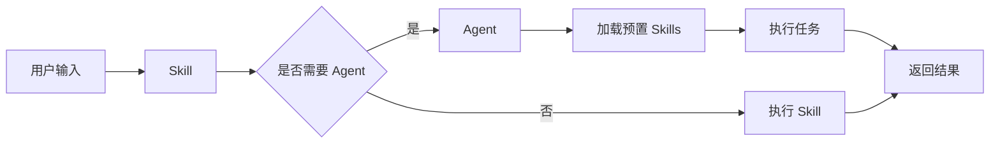

# 技能与 Agent 配合

> 深入解析 Skill 与 Agent 的组合使用模式

## 核心区别

| 维度 | Skill | Agent |
|------|-------|-------|
| 用途 | 单一任务/工作流 | 复杂角色扮演 |
| 生命周期 | 按需调用 | 持续运行 |
| 上下文 | 共享主会话 | 可独立上下文 |
| 触发方式 | `/skill-name` | 隐式启动 |
| 配置复杂度 | 简单 | 复杂 |

---

## 组合模式

### 模式 1：Skill 调用 Agent

```yaml
---
name: code-review
agent: reviewer
tools:
  - Read
  - Grep
  - Glob
---

执行代码审查...
```

**适用场景**：
- Skill 需要 Agent 的角色能力
- 需要 Agent 持续执行多个步骤

### 模式 2：Agent 预加载 Skills

```json
{
  "agents": {
    "full-reviewer": {
      "description": "全面代码审查",
      "skills": [
        "security-check",
        "performance-check",
        "best-practices"
      ]
    }
  }
}
```

**适用场景**：
- Agent 需要多个专业技能
- 复杂审查任务需要分工

### 模式 3：互相调用

```
Skill → Agent → Skills → Agent → ...
```

---

## 实际示例

### 示例 1：SQL 优化工作流

```yaml
---
name: sql-optimizer
description: SQL 优化助手
paths:
  - "*.sql"
agent: dba
allowed-tools:
  Bash(psql:*)
  Read
---

# SQL 优化工作流

## 输入
- `$query`: 要优化的 SQL 查询

## 步骤

### 1. 分析查询
使用 `EXPLAIN` 分析查询计划。

### 2. 检查索引
验证相关索引是否存在。

### 3. 应用优化
如果需要，添加索引或重写查询。
```

### 示例 2：前端代码审查

```json
{
  "agents": {
    "frontend-reviewer": {
      "description": "前端代码审查专家",
      "skills": [
        "react-best-practices",
        "accessibility-check",
        "performance-audit"
      ],
      "tools": [
        "Read",
        "Grep",
        "Glob",
        "Bash(npm:*)"
      ]
    }
  }
}
```

---

## 配置最佳实践

### 1. 明确的职责边界

```yaml
# Skill：执行特定任务
---
name: security-check
description: 安全检查
---

# Agent：协调多个任务
---
name: security-expert
description: 安全专家
skills:
  - security-check
  - dependency-audit
---
```

### 2. 权限匹配

```yaml
# Skill 权限
---
name: db-migration
allowed-tools:
  Bash(psql:*)
  Read
---

# Agent 权限（至少包含 Skill 权限）
{
  "agents": {
    "dba": {
      "tools": [
        "Bash(psql:*)",
        "Bash(psql -h *)",
        "Read",
        "Grep"
      ]
    }
  }
}
```

### 3. 避免过度嵌套

```yaml
# ❌ 过度嵌套
Skill A
  → Agent B
    → Skill C
      → Agent D
        → ...

# ✅ 扁平化
Skill A → Agent B
Skill C → Agent D
```

---

## 数据流



---

## 调试技巧

### 查看 Skills 加载

```bash
claude --debug skills
```

### 查看 Agents 调用

```bash
claude --debug agent
```

### 测试组合

```bash
# 测试 Skill
claude -p "/skill-name"

# 测试 Agent
claude --agent agent-name -p "任务描述"
```

---

## 常见问题

### Q: Skill 和 Agent 哪个先选？

**A**: 根据任务复杂度
- 单一任务 → Skill
- 复杂角色 → Agent
- 需要分工 → Agent + Skills

### Q: 权限冲突怎么办？

**A**: Agent 权限应包含 Skill 权限的并集。

### Q: 如何避免循环调用？

**A**: 设定明确的退出条件，避免 Skill 调用包含自己的 Agent。
