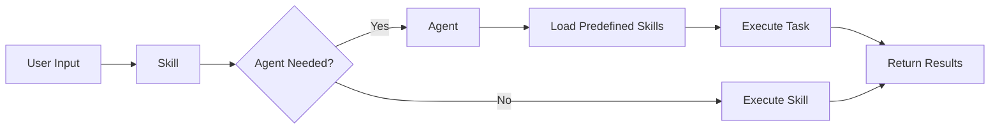

# Skills and Agents Collaboration

> In-depth analysis of Skill and Agent combination patterns

## Core Differences

| Dimension | Skill | Agent |
|-----------|-------|-------|
| Purpose | Single task/workflow | Complex role-playing |
| Lifecycle | On-demand invocation | Persistent execution |
| Context | Shared main session | Independent context available |
| Trigger | `/skill-name` | Implicit start |
| Configuration complexity | Simple | Complex |

---

## Combination Patterns

### Pattern 1: Skill Invoking Agent

```yaml
---
name: code-review
agent: reviewer
allowed-tools:
  - Read
  - Grep
  - Glob
---

Execute code review...
```

**Use Cases**:
- Skill needs Agent's role capabilities
- Requires Agent to persistently execute multiple steps

### Pattern 2: Agent Preloading Skills

```json
{
  "agents": {
    "full-reviewer": {
      "description": "Comprehensive code review",
      "skills": [
        "security-check",
        "performance-check",
        "best-practices"
      ]
    }
  }
}
```

**Use Cases**:
- Agent needs multiple specialized skills
- Complex review tasks require division of labor

### Pattern 3: Mutual Invocation

```
Skill → Agent → Skills → Agent → ...
```

---

## Practical Examples

### Example 1: SQL Optimization Workflow

```yaml
---
name: sql-optimizer
description: SQL optimization assistant
paths:
  - "*.sql"
agent: dba
allowed-tools:
  Bash(psql:*)
  Read
---

# SQL Optimization Workflow

## Inputs
- `$query`: SQL query to optimize

## Steps

### 1. Analyze Query
Use `EXPLAIN` to analyze query plan.

### 2. Check Indexes
Verify if relevant indexes exist.

### 3. Apply Optimization
If needed, add indexes or rewrite query.
```

### Example 2: Frontend Code Review

```json
{
  "agents": {
    "frontend-reviewer": {
      "description": "Frontend code review expert",
      "skills": [
        "react-best-practices",
        "accessibility-check",
        "performance-audit"
      ],
      "tools": [
        "Read",
        "Grep",
        "Glob",
        "Bash(npm:*)"
      ]
    }
  }
}
```

---

## Configuration Best Practices

### 1. Clear Responsibility Boundaries

```yaml
# Skill: Execute specific tasks
---
name: security-check
description: Security check
---

# Agent: Coordinate multiple tasks
---
name: security-expert
description: Security expert
skills:
  - security-check
  - dependency-audit
---
```

### 2. Permission Matching

```yaml
# Skill permissions
---
name: db-migration
allowed-tools:
  Bash(psql:*)
  Read
---

# Agent permissions (must include at least Skill permissions)
{
  "agents": {
    "dba": {
      "tools": [
        "Bash(psql:*)",
        "Bash(psql -h *)",
        "Read",
        "Grep"
      ]
    }
  }
}
```

### 3. Avoid Over-nesting

```yaml
# ❌ Over-nested
Skill A
  → Agent B
    → Skill C
      → Agent D
        → ...

# ✅ Flattened
Skill A → Agent B
Skill C → Agent D
```

---

## Data Flow



---

## Debugging Tips

### View Skills Loading

```bash
claude --debug skills
```

### View Agent Invocations

```bash
claude --debug agent
```

### Test Combinations

```bash
# Test Skill
claude -p "/skill-name"

# Test Agent
claude --agent agent-name -p "Task description"
```

---

## FAQ

### Q: Which should I choose first, Skill or Agent?

**A**: Based on task complexity
- Single task → Skill
- Complex role → Agent
- Requires division of labor → Agent + Skills

### Q: What about permission conflicts?

**A**: Agent permissions should include the union of Skill permissions.

### Q: How to avoid circular invocations?

**A**: Set clear exit conditions, avoid Skills invoking Agents that include themselves.
